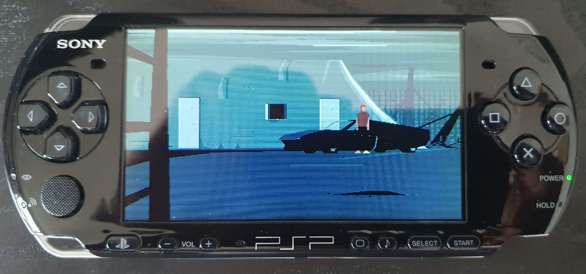
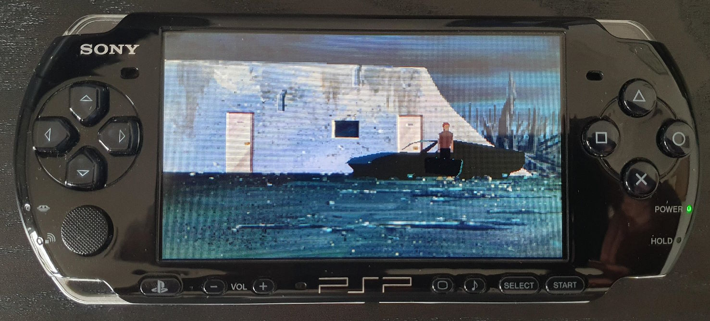
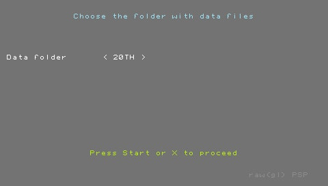
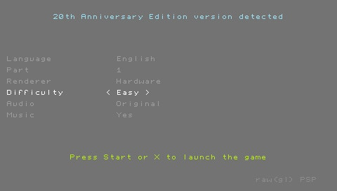

# raw(gl)_psp - Another World Interpreter ported to Sony's Playstation Portable

rawgl_psp is a port to Sony's Playstation Portable of rawgl, a re-implementation of the engine used in the game Another World.

 

The original project can be found [here](https://github.com/cyxx/rawgl).

The OpenGL renderer of the original project was removed and a new one using the GU library of the PSPSDK was added.

Some limitations of the original project were kept in this version and some others were fixed along with some bugs that were found.

## Building

This project needs [PSPSDK](https://github.com/pspdev/pspsdk) and SDL2 libraries for PSP to build. 

Then you can just run:
```
make
```

## Running

The program requires the original data files to be placed together with the EBOOT.PBP file or in a sub-folder relative to this file's location.

When first running the program you'll be asked to choose the folder where the data is:



Then options that apply to the version of the data selected can be set: 



There are 2 renderers available just as in the the original rawgl project:
 - Software renderer - a pure software renderer.
 - Hardware renderer - a renderer that uses the gu library of the PSPSDK.
The two renderers have similar capability, some might have some known issues, check the section below, use the one that you feel works best for you and your data.

There is an option to disable music for the 15th and 2th anniversary editions, this is due to music loading sonsiderably slowing down loading.

Keys:
```
  D-pad         Move player
  Cross         Action
  Circle/Square Jump (for some editions)
  Start         Pause game
```

## Known issues

When using 15th or 20th anniversary editions data files, loading OGG music can be very slow, therefore an option to disable music was included.

Some sounds in the 15th and 20th anniversary editions can sound wrong.

Effects using "texture" polygons (such as in the scene where the player is teleported to inside a pool of water at the begining of the game) may not work properly in editions with bitmap backgrounds when using the software renderer.

Not all supported editions were thoroughly tested.

Custom fonts used in some editions are currently not implemented.
